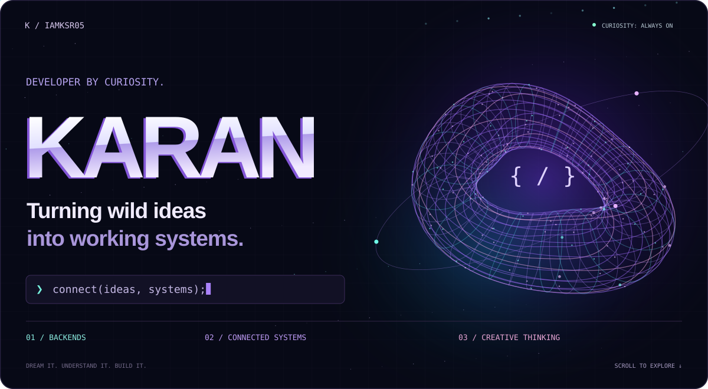
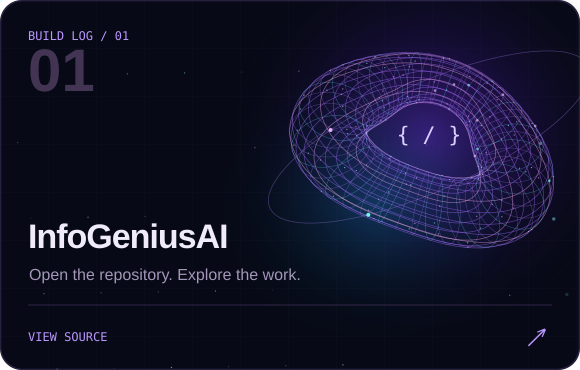
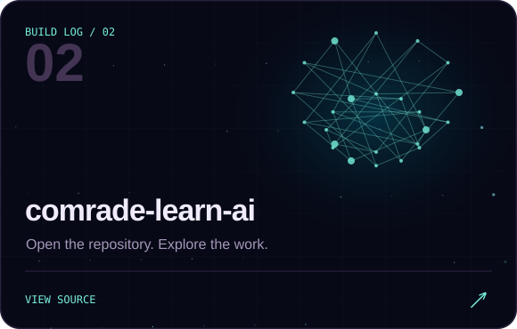

<!-- Custom, repository-hosted SVG artwork. Keep assets/ alongside this README. -->
<picture>
  <source media="(max-width: 600px)" srcset="./assets/hero-mobile.svg" />
  
</picture>

 

  
  
  
  

 

## 01 / The person behind the code

I'm **Karan**. I like knowing what happens *after* you click the button — the API call, the backend logic, the database query, and the pieces that make a product work.

I build across those connections, learn through real projects, and bring a creative eye to the experience. My next frontier is **AI & machine learning**. My approach stays the same: understand it, experiment with it, and make something useful.

> **Curious enough to take it apart. Persistent enough to put it back together.**

 

## 02 / Selected work

Two repositories from my building journey. Dive into the code, explore the decisions, and see the work for yourself.

**[Explore all repositories ↗](https://github.com/iamksr05?tab=repositories)**

 

## 03 / My working toolkit

Tools I use, ideas I'm exploring, and the creative side that comes with me.

| Area | Technologies & tools |
| :--- | :--- |
| **Code** | Python · JavaScript · C · HTML · CSS |
| **Backend** | Node.js · API flows · System integration |
| **Data** | MySQL · MongoDB |
| **Workflow** | Git · GitHub · VS Code · Postman |
| **Exploring** | Express.js · React · Tailwind CSS · AI/ML fundamentals |
| **Creative** | After Effects · Premiere Pro · Figma |

 

## 04 / How I think

**Understand the system.** Follow the data, question the assumptions, and figure out how the pieces connect.

**Make it useful.** Build for real people, with clear interactions and a reason behind each decision.

**Keep the creative edge.** Code, motion, and design are different ways to turn an idea into an experience.

**Stay a learner.** Experiment. Test. Break things. Fix them. Carry the lesson into the next build.

 

## 05 / The work continues

Backend depth. Better interfaces. AI/ML foundations. There's always another layer to understand.

**[See my GitHub activity ↗](https://github.com/iamksr05?tab=overview)**

<b>A little motion from my contribution history 🐍</b>

 
<picture>
  <source media="(prefers-color-scheme: dark)" srcset="https://raw.githubusercontent.com/iamksr05/iamksr05/output/github-snake-dark.svg" />
  <source media="(prefers-color-scheme: light)" srcset="https://raw.githubusercontent.com/iamksr05/iamksr05/output/github-snake.svg" />
  
</picture>

Generated from my GitHub contributions by the workflow in this repository.

 

Dream. Learn. Innovate. &nbsp; / &nbsp; <a href="https://github.com/iamksr05">@iamksr05</a>

