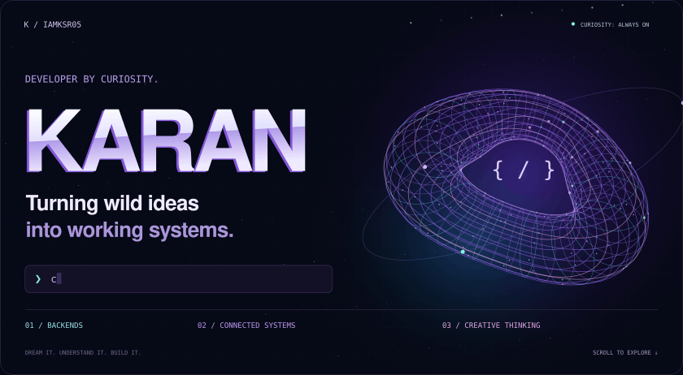
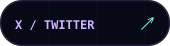
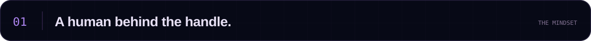
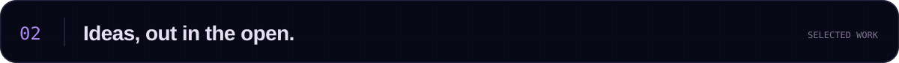
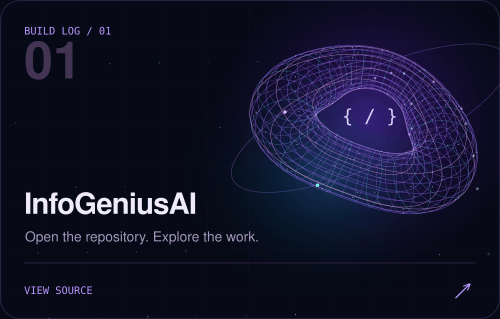
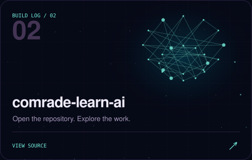
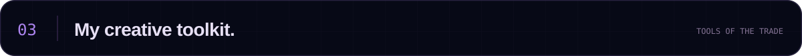
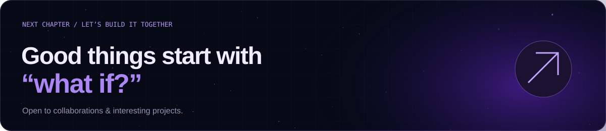

<!-- Self-contained motion artwork. Upload the entire assets folder with this README. -->
<picture>
  <source media="(prefers-reduced-motion: reduce) and (max-width: 600px)" srcset="./assets/hero-mobile.svg" />
  <source media="(prefers-reduced-motion: reduce)" srcset="./assets/hero.svg" />
  <source media="(max-width: 600px)" srcset="./assets/hero-mobile.gif" />
  
</picture>

 

  
  
  
  

 

<picture><source media="(max-width: 600px)" srcset="./assets/section-01-mobile.svg" /></picture>

 

**Hey, I'm Karan.** I follow the interesting questions. What happens after you click that button? How does the data get there? What makes all these systems work together?

That curiosity takes me through **APIs, backend logic, databases, and system integration** — with a creative eye for the experience on the other side. I'm also exploring **AI & machine learning**, one experiment at a time.

> **I build to understand. I break things to learn. I keep going to make them better.**

 

<picture><source media="(max-width: 600px)" srcset="./assets/section-02-mobile.svg" /></picture>

 

A few stops on my building journey. Click a card to explore the code.

<a href="https://github.com/iamksr05/InfoGeniusAI"><picture><source media="(prefers-reduced-motion: reduce)" srcset="./assets/project-infogenius.svg" /></picture></a>
<a href="https://github.com/iamksr05/comrade-learn-ai"><picture><source media="(prefers-reduced-motion: reduce)" srcset="./assets/project-comrade.svg" /></picture></a>

**[Explore all repositories ↗](https://github.com/iamksr05?tab=repositories)**

 

<picture><source media="(max-width: 600px)" srcset="./assets/section-03-mobile.svg" /></picture>

 

Tools I use, ideas I'm exploring, and the creative side that comes with me.

| Area | Technologies & tools |
| :--- | :--- |
| **Code** | Python · JavaScript · C · HTML · CSS |
| **Backend** | Node.js · API flows · System integration |
| **Data** | MySQL · MongoDB |
| **Workflow** | Git · GitHub · VS Code · Postman |
| **Exploring** | Express.js · React · Tailwind CSS · AI/ML fundamentals |
| **Creative** | After Effects · Premiere Pro · Figma |

 

**Currently exploring:** backend depth, better interfaces, and AI/ML foundations.

**Creative side quests:** motion, video editing, and making digital things feel intuitive.

 

<b>A little motion from my contribution history 🐍</b>

 
<picture>
  <source media="(prefers-color-scheme: dark)" srcset="https://raw.githubusercontent.com/iamksr05/iamksr05/output/github-snake-dark.svg" />
  <source media="(prefers-color-scheme: light)" srcset="https://raw.githubusercontent.com/iamksr05/iamksr05/output/github-snake.svg" />
  
</picture>

Generated from my GitHub contributions by the workflow in this repository.

 

<a href="mailto:karankr2885@gmail.com"><picture><source media="(max-width: 600px)" srcset="./assets/footer-mobile.svg" /></picture></a>

Dream. Learn. Innovate. &nbsp; / &nbsp; <a href="https://github.com/iamksr05">@iamksr05</a>

